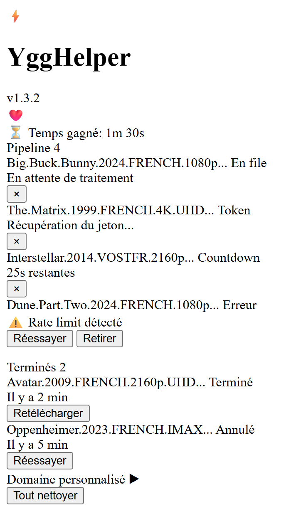
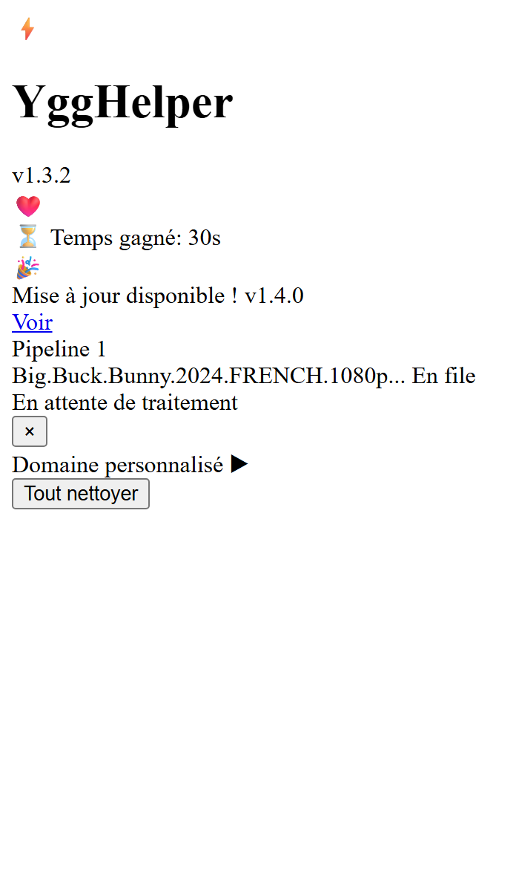

# ⚡ YggTorrent Helper (Smart Timer)


> Fork de [MoowGlax/ygg-helper-dl](https://github.com/MoowGlax/ygg-helper-dl) — merci à MoowGlax pour le projet original !

Une extension web optimisée pour YggTorrent qui gère intelligemment le temps d'attente de téléchargement. Ouvrez vos pages de torrent, tout le reste est automatique — file d'attente, countdown, téléchargement. Zero friction.



## 🚀 Fonctionnalités

- **Pipeline Automatique** : Visitez des pages de torrents, ils sont automatiquement mis en file d'attente et téléchargés séquentiellement. Aucun clic nécessaire après la visite.
- **File d'attente Persistante** : Les torrents en attente survivent au redémarrage du navigateur et du Service Worker grâce au stockage `chrome.storage`.
- **7 États Visuels** :
  - **En file** : En attente de traitement
  - **Token** : Demande du jeton au serveur
  - **Countdown** : Compte à rebours de 30 secondes
  - **Téléchargement** : Téléchargement automatique en cours
  - **Terminé** : Fichier téléchargé avec succès
  - **Annulé** : Téléchargement annulé par l'utilisateur
  - **Erreur** : Échec (retry automatique ou manuel)
- **Gestion du Rate-Limit** : Détection automatique des erreurs 429 et "fichier indisponible", avec backoff exponentiel et retry.
- **Onglet Caché Fallback** : Si aucun onglet YggTorrent n'est ouvert, un onglet temporaire est créé en arrière-plan pour obtenir le token.
- **Navigation Libre** : Grâce au Service Worker et aux alarmes Chrome, le pipeline continue même si vous fermez les onglets.
- **Multi-Domaines** : Supporte tous les domaines YggTorrent connus + possibilité d'ajouter un domaine personnalisé.
- **Mises à jour Automatiques** : Notification intégrée pour les nouvelles versions.



## 🔄 Différences avec le projet original

| Fonctionnalité | MoowGlax (original) | RicherTunes (ce fork) |
|---|---|---|
| File d'attente | Manuelle (clic requis) | **Automatique (pipeline persistant)** |
| Téléchargement | Clic "Télécharger" requis | **Auto-download après countdown** |
| Rate-limiting | Aucune gestion | **Classification 4 types + backoff exponentiel** |
| Service Worker restart | Perte de l'état | **Récupération automatique + détection stale** |
| Domaines | Un seul | **24 domaines + domaine personnalisé** |
| Timer | setInterval (fragile) | **chrome.alarms (fiable MV3)** |
| Navigation SPA | Non supportée | **Détection pushState/popstate/bfcache** |
| Onglets fermés | Échec du token | **Fallback onglet caché réutilisable** |
| Navigateurs | Chrome | **Chrome, Brave, Opera, Edge** |
| Sécurité | Basique | **Sanitisation XSS, verrou lease-based** |

## 📦 Installation

Cette extension n'est pas disponible sur le Chrome Web Store. Vous avez deux options pour l'installer.

### Option 1 : Via le code source (Recommandé)

1. **Télécharger le projet** :
   - Clonez ce dépôt ou téléchargez le fichier ZIP (Code > Download ZIP) et décompressez-le.

2. **Charger l'extension** :
   - Allez sur la page des extensions de votre navigateur :
     - Chrome : `chrome://extensions`
     - Brave : `brave://extensions`
     - Opera : `opera://extensions`
     - Edge : `edge://extensions`
   - Activez le **Mode développeur**.
   - Cliquez sur **"Charger l'extension non empaquetée"** (Load unpacked).
   - Sélectionnez le dossier racine du projet.

3. **Épingler l'extension** :
   - Cliquez sur l'icône puzzle (🧩) dans la barre d'outils.
   - Épinglez **YggHelper** pour un accès rapide.

### Option 2 : Via le fichier .crx

1. **Télécharger l'extension** :
   - Rendez-vous dans la section [Releases](https://github.com/RicherTunes/ygg-helper-dl/releases) et téléchargez le dernier fichier `.crx`.

2. **Installer** :
   - Ouvrez la page des extensions et activez le **Mode développeur**.
   - Glissez-déposez le fichier `.crx` directement dans la page des extensions.

> **Note :** Certains navigateurs (Brave notamment) peuvent restreindre les extensions installées via `.crx`. Préférez l'option 1 pour le développement et le test.

## 🦊 Installation sur Firefox

**WIP**

## 🛠️ Utilisation

1. Naviguez sur YggTorrent comme d'habitude.
2. Ouvrez la fiche d'un torrent — le widget "⚡ Helper" apparaît et l'enqueue automatiquement.
3. Continuez à ouvrir d'autres torrents, ils s'ajoutent à la file d'attente.
4. Ouvrez le popup (clic sur l'icône ⚡) pour suivre la progression du pipeline.
5. Les fichiers se téléchargent automatiquement, un par un, avec un délai de sécurité entre chaque.

### 🌐 Domaine personnalisé

Si YggTorrent change de domaine et que l'extension ne fonctionne plus :

1. Ouvrez le popup de l'extension.
2. Dépliez la section **"Domaine personnalisé"** en bas.
3. Entrez le nouveau domaine (ex: `yggtorrent.exemple`).
4. Cliquez **OK** et acceptez la demande de permission.
5. Rechargez la page YggTorrent.

## 🔨 Build

Un script PowerShell est fourni pour générer un fichier `.crx` :

```powershell
.\build.ps1
```

La clé de signature (`ygg-helper-dl-key.pem`) est générée automatiquement au premier build et stockée dans le dossier parent. Ne la partagez pas.

## ❓ FAQ

### L'extension ne détecte pas les torrents sur Brave

Sur Brave, les extensions installées via `.crx` peuvent mal fonctionner. Utilisez **"Charger l'extension non empaquetée"** (voir Installation).

### J'ai une erreur "Rate limit"

YggTorrent limite le nombre de téléchargements. L'extension réessaie automatiquement avec un délai croissant. Attendez quelques minutes.

### Le domaine YggTorrent a changé

Utilisez la fonctionnalité **"Domaine personnalisé"** dans le popup pour ajouter le nouveau domaine.

### Les torrents restent en file d'attente

Vérifiez que vous êtes connecté à votre compte YggTorrent. Certains torrents nécessitent une authentification.

### J'ai annulé un téléchargement par erreur

Les téléchargements annulés apparaissent avec le statut "Annulé". Cliquez sur "Réessayer" dans le popup pour le relancer. Il sera traité en priorité (en tête de file).

### Comment voir les logs ?

Ouvrez la console du Service Worker :
1. Allez sur `chrome://extensions`
2. Cliquez sur "Service Worker" sous YggTorrent Helper
3. La console s'ouvre avec les logs `[Pipeline]`

## 📚 Documentation

- [Guide Utilisateur](docs/USER_GUIDE.md) — Guide complet en français
- [Architecture](docs/ARCHITECTURE.md) — Diagrammes et design technique
- [CHANGELOG](CHANGELOG.md) — Historique des versions
- [Contribuer](CONTRIBUTING.md) — Guide pour les contributeurs

## 🙏 Crédits

- **[MoowGlax](https://github.com/MoowGlax)** — Auteur original de ygg-helper-dl
- **[RicherTunes](https://github.com/RicherTunes)** — Mainteneur de ce fork

## 🤝 Contribution

Les contributions sont les bienvenues ! N'hésitez pas à ouvrir une Issue ou une Pull Request.

## ⚠️ Avertissement

Ce projet est à but éducatif et personnel uniquement. L'auteur n'est pas responsable de l'utilisation qui en est faite. Assurez-vous de respecter les conditions d'utilisation des sites que vous visitez et les lois en vigueur dans votre pays concernant le téléchargement.
