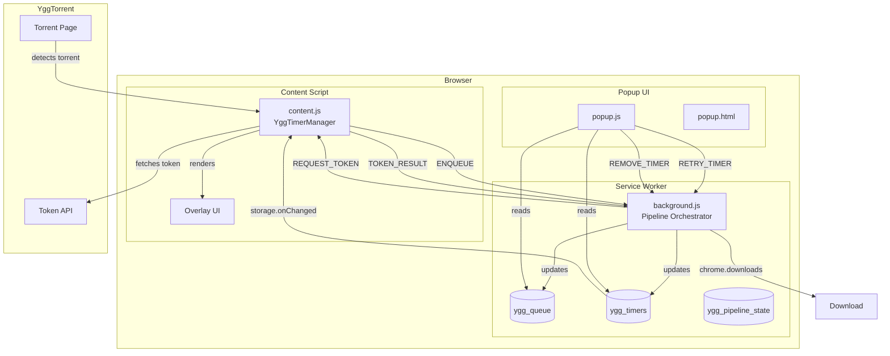
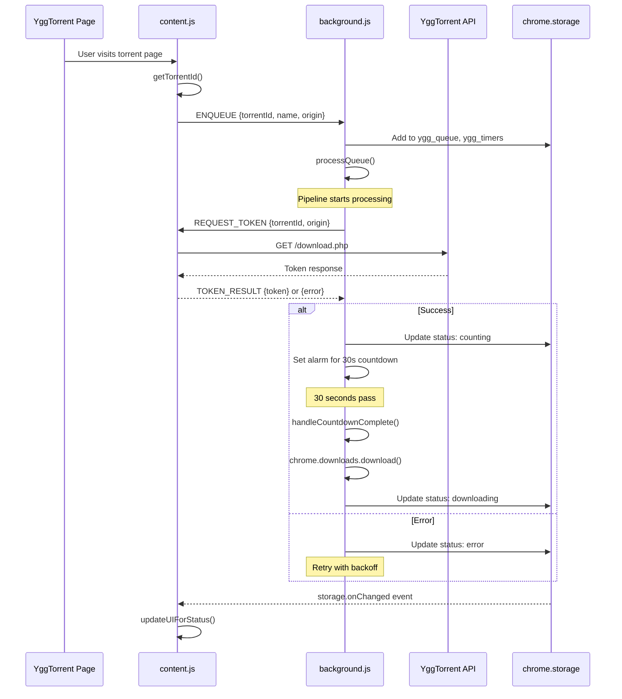
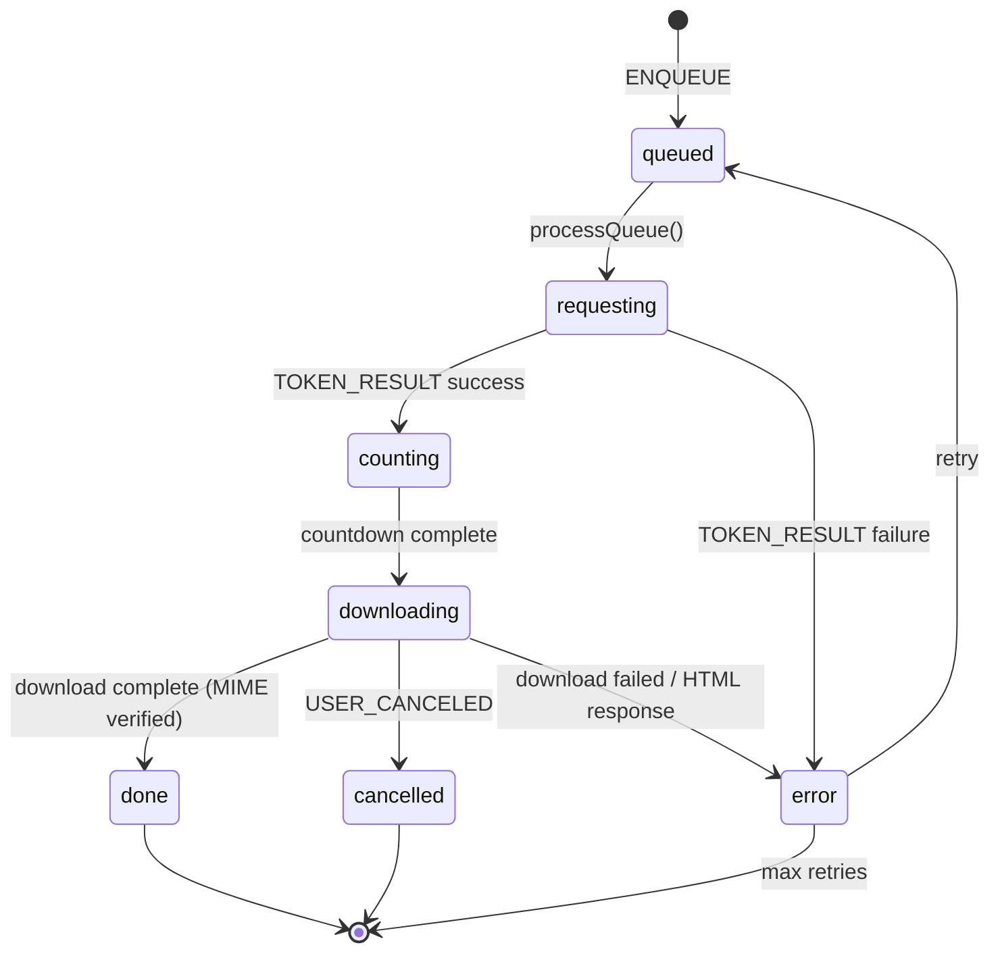
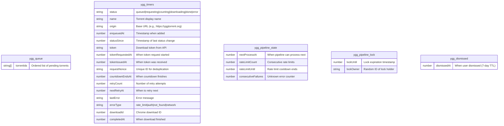
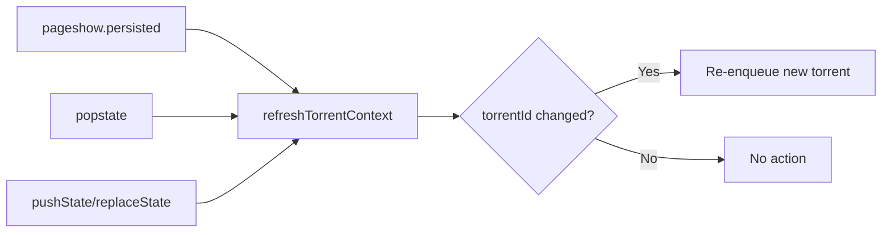
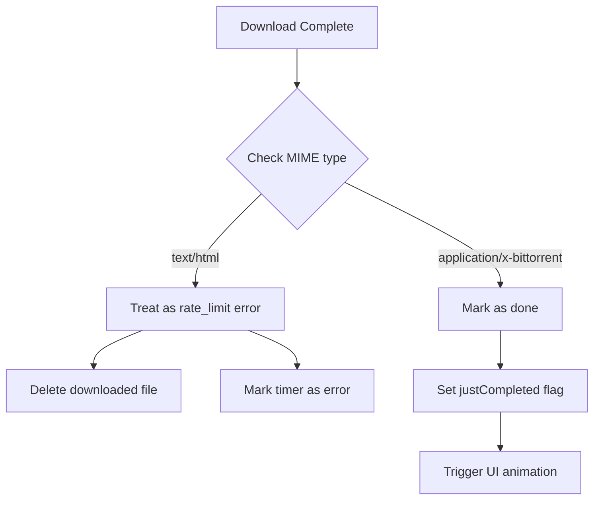

# Architecture Overview

## System Diagram



## Message Flow



## Timer Status Machine



**7 statuses**: `queued`, `requesting`, `counting`, `downloading`, `done`, `cancelled`, `error`

| Status | Description | User Action Available |
|--------|-------------|----------------------|
| `queued` | Waiting in pipeline | Remove |
| `requesting` | Fetching token from API | None |
| `counting` | 30-second countdown active | Remove |
| `downloading` | Chrome download in progress | None |
| `done` | Successfully downloaded | Retélécharger |
| `cancelled` | User canceled download | Réessayer |
| `error` | Failed with classified error | Réessayer / Retirer |

## Storage Schema



## Component Responsibilities

| Component | Responsibility |
|-----------|---------------|
| `background.js` | Pipeline orchestration, queue management, token requests, downloads, alarms |
| `content.js` | Torrent detection, token fetching, UI rendering |
| `popup.js` | Dashboard display, user actions (retry/remove) |

## Key Design Decisions

### Why chrome.alarms instead of setTimeout?

Manifest V3 Service Workers can be terminated at any time. `setTimeout`/`setInterval` callbacks are lost when the worker dies. `chrome.alarms` persists and wakes the worker.

### Why a lease-based lock?

Multiple async operations may try to process the queue simultaneously. The lock prevents race conditions with a TTL to handle crashed workers.

### Why hidden tab fallback?

If the user closes all YggTorrent tabs, there's no content script to fetch tokens. The hidden tab provides a temporary context for token acquisition.

## Error Classification System

The pipeline classifies errors into 4 types with different handling policies:

| Error Type | Detection | Policy |
|------------|-----------|--------|
| `rate_limit` | HTTP 429, HTML response, "wasn't available" message | Global backoff (all items wait) |
| `auth` | HTTP 403, login redirect | No auto-retry (user must login) |
| `not_found` | HTTP 404 | Remove from queue permanently |
| `network` | Timeout, fetch error | Per-item exponential backoff (max 5 retries) |

### Consecutive Failures Escalation

Unknown errors are tracked via `consecutiveFailures` counter. After 2 consecutive unknown errors, the pipeline escalates to rate-limit mode as a safety net.

## Stale State Detection

The pipeline detects and recovers from stuck states:

| State | Timeout | Recovery |
|-------|---------|----------|
| `requesting` | 30 seconds | Reset to `queued`, retry |
| `downloading` | 5 minutes | Mark as `error`, retry if under max |

## Request Deduplication

Each token request includes a `requestNonce` (random ID). Late responses with outdated nonces are ignored to prevent state corruption.

## Hidden Tab Optimization

The hidden tab is **reused** across multiple requests when possible:
- Tab is created on first fallback
- Tab persists for subsequent requests to same domain
- Tab is recycled when domain changes
- Reduces overhead of repeated tab creation

## SPA/bfcache Navigation Handling

The content script handles modern navigation patterns:



The history API is patched to intercept `pushState`/`replaceState` calls.

## Download Filename Sanitization

Filenames are sanitized before download to prevent filesystem errors:
1. Remove control characters (`\x00-\x1f`)
2. Remove filesystem-unsafe characters (`<>:"/\|?*`)
3. Remove trailing dots/spaces (Windows issue)
4. Truncate to 150 characters max
5. Append `.torrent` extension if missing

## Pipeline Recovery on Startup

When the Service Worker restarts (`onStartup`/`onInstalled`):

1. **Recreate missing alarms** — Countdown alarms are recreated from `countdownEndsAt`
2. **Clean stale states** — Items stuck in `requesting`/`downloading` are reset
3. **Resume processing** — `processQueue()` is called to continue

## Configuration Constants

| Constant | Value | Purpose |
|----------|-------|---------|
| `TIMER_DURATION` | 30s | YggTorrent mandatory wait |
| `LOCK_TTL` | 15s | Pipeline lock duration |
| `STALE_REQUESTING_TIMEOUT` | 30s | Max time waiting for token |
| `STALE_DOWNLOADING_TIMEOUT` | 5min | Max time for download |
| `COOLDOWN_BETWEEN_DOWNLOADS` | 3s | Delay between downloads |
| `MAX_RETRIES` | 5 | Max network error retries |
| `BASE_RETRY_DELAY` | 5s | Initial retry delay |
| `MAX_RETRY_DELAY` | 2min | Max retry delay cap |
| `CLEANUP_INTERVAL` | 1h | Cleanup completed timers |
| `DISMISSED_TTL` | 7 days | Expiry for dismissed torrents |

## Download Verification

When a download completes, the pipeline verifies it wasn't an HTML error page (expired/invalid token):



This catches cases where YggTorrent returns an error page instead of the torrent file.

## User Cancellation Handling

When a user manually cancels a download:

```javascript
if (delta.error.current === 'USER_CANCELED') {
    timer.status = 'cancelled';  // Not 'error'
    // No auto-retry, User can manually retry.
}
```

**Cancelled items**:
- Do not auto-retry
- Show "Annulé — Réessayer" in UI
- Can be re-enqueued via manual retry button

## Retry Priority

When user clicks "Réessayer":
- Timer is added to **front** of queue (`queue.unshift()`)
- Dismissed status is cleared
- All retry state is reset (retryCount, nextRetryAt, lastError, errorType)

## Cleanup Behavior

The extension automatically cleans up old data:

| Data Type | TTL | Action |
|-----------|-----|--------|
| `done` timers | 1 hour | Removed from storage |
| `cancelled` timers | 1 hour | Removed from storage |
| `error` timers (no retry) | 1 hour | Removed from storage |
| `dismissed` entries | 7 days | Cleared from dismissed list |

## Hidden Tab Cleanup

The hidden tab is automatically closed when:
1. No more queued items for that origin
2. User removes all torrents from that domain
3. Pipeline becomes empty

## justCompleted Flag

On download success, a `justCompleted: true` flag is set:
- Used by content script to show "✅ Téléchargé !" animation
- Widget fades out after 5 seconds
- On page revisit, widget shows "✅ Déjà téléchargé — Retélécharger"
| `DISMISSED_TTL` | 7 days | Remembered removal duration |

## Download Verification

Downloads are verified after completion to detect token expiration:

| Check | Condition | Action |
|-------|-----------|--------|
| MIME type | `text/html` instead of torrent | Treat as `rate_limit`, delete file, retry |
| User cancel | `USER_CANCELED` error | Set status `cancelled`, no auto-retry |
| Network error | Other interruption | Set status `error`, retry with backoff |

## Completion Tracking

When a download completes successfully:

1. **`justCompleted` flag** — Set to `true` for UI animation (fades out widget after 5s)
2. **Cooldown** — 3-second delay before processing next item
3. **Hidden tab cleanup** — Closed if no more items for that origin

## Manual Retry Priority

When user clicks "Réessayer" (retry):
- Torrent is added to the **front** of the queue (`unshift`)
- All error state is cleared (`retryCount`, `lastError`, etc.)
- Removed from dismissed list (allows re-enqueue on page revisit)

## Automatic Cleanup

The pipeline automatically cleans up old data:

| Data Type | TTL | Trigger |
|-----------|-----|---------|
| Completed torrents | 1 hour | `CLEANUP_INTERVAL` alarm |
| Cancelled torrents | 1 hour | `CLEANUP_INTERVAL` alarm |
| Dismissed torrents | 7 days | `CLEANUP_INTERVAL` alarm |
| Stale requesting | 30 seconds | `processQueue()` |
| Stale downloading | 5 minutes | `processQueue()` |

## Update Notification System

The extension checks for updates daily:

1. **Fetch** manifest from GitHub (`GITHUB_MANIFEST_URL`)
2. **Compare** versions using semantic versioning
3. **Notify** via:
   - Badge text "NEW" (red background)
   - `ygg_update_available` storage entry
   - Popup banner with link to releases

## Custom Domain Script Registration

Dynamic content script registration for new domains:

```javascript
chrome.scripting.registerContentScripts([{
    id: 'ygg-custom-domain',
    matches: [`*://*.${domain}/*`, `*://${domain}/*`],
    js: ['content.js'],
    css: ['content.css'],
    runAt: 'document_idle',
    persistAcrossSessions: true  // Survives browser restart
}]);
```

Scripts are unregistered before re-registration to handle domain changes.

