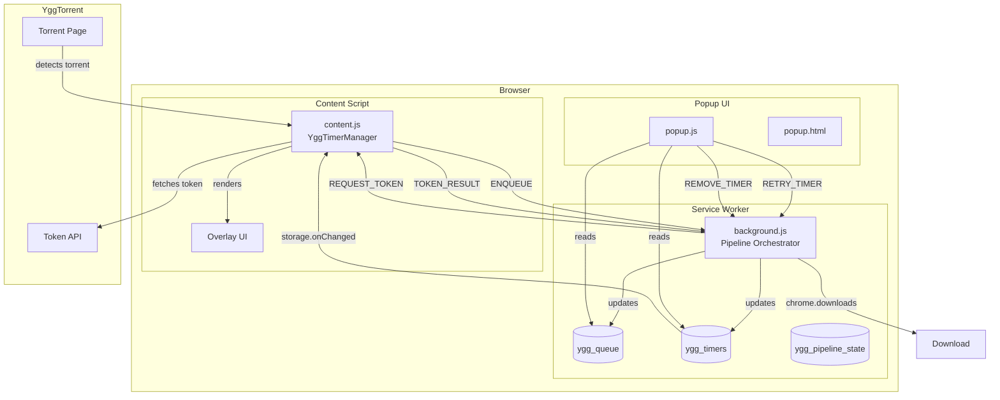
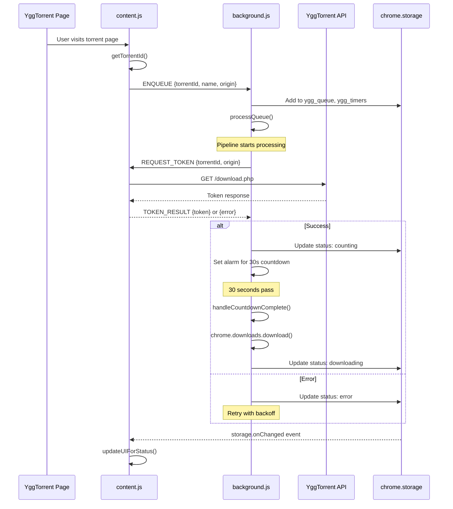
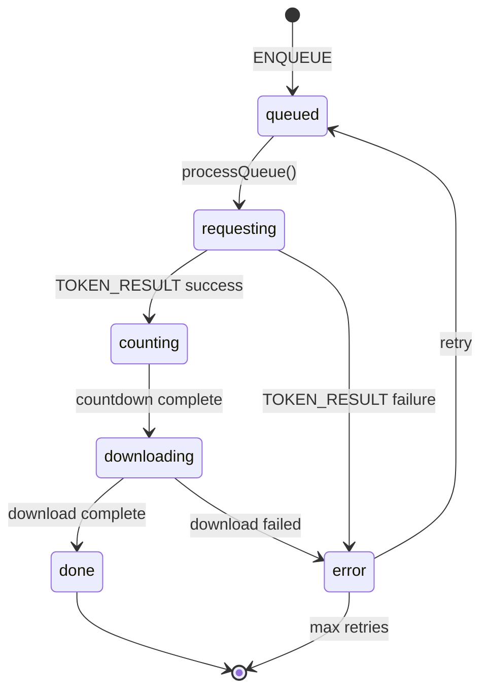
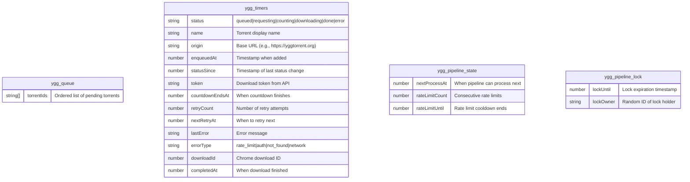

# Architecture Overview

## System Diagram

## Message Flow

## Timer Status Machine

## Storage Schema

## Component Responsibilities

| Component | Responsibility |
|-----------|---------------|
| `background.js` | Pipeline orchestration, queue management, token requests, downloads, alarms |
| `content.js` | Torrent detection, token fetching, UI rendering |
| `popup.js` | Dashboard display, user actions (retry/remove) |

## Key Design Decisions

### Why chrome.alarms instead of setTimeout?

Manifest V3 Service Workers can be terminated at any time. `setTimeout`/`setInterval` callbacks are lost when the worker dies. `chrome.alarms` persists and wakes the worker.

### Why a lease-based lock?

Multiple async operations may try to process the queue simultaneously. The lock prevents race conditions with a TTL to handle crashed workers.

### Why hidden tab fallback?

If the user closes all YggTorrent tabs, there's no content script to fetch tokens. The hidden tab provides a temporary context for token acquisition.
